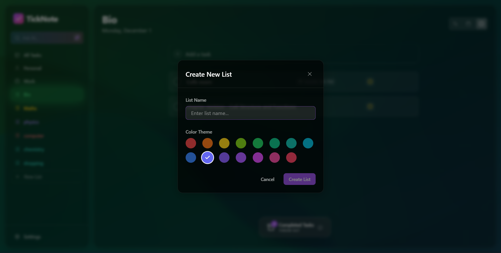
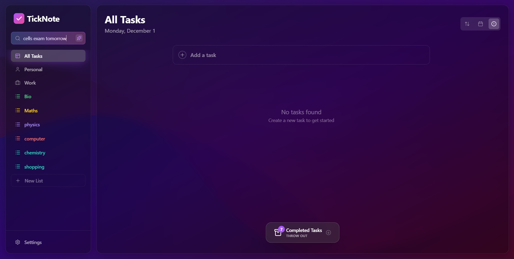
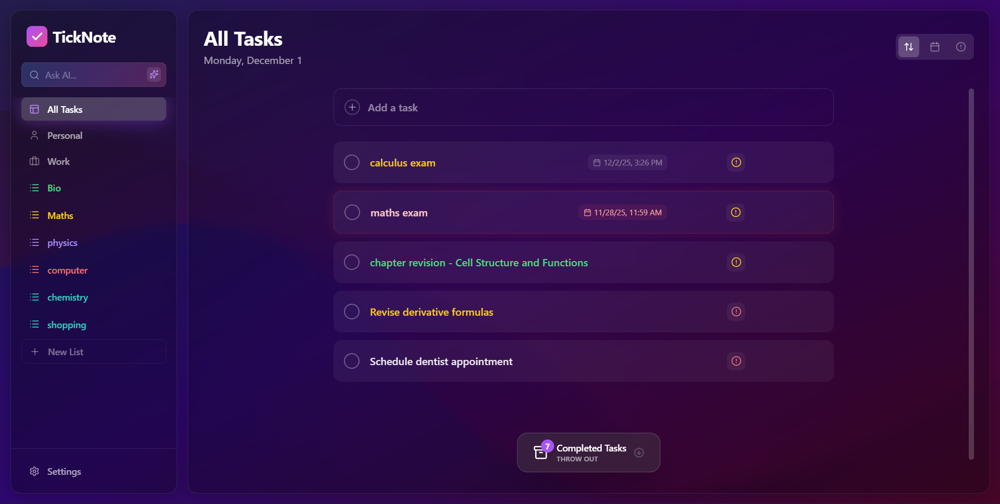
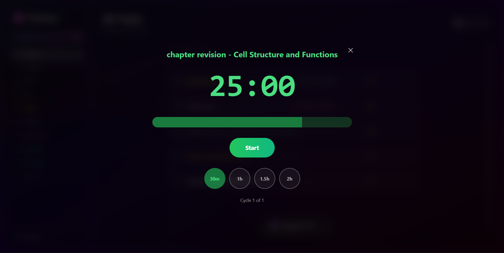

# TickNote - Aesthetically pleasing task management application

TickNote is a modern, AI-powered task management application designed to help you organize your life and boost productivity. Built with React, TypeScript, and Vite, it features a beautiful, responsive interface and a smart AI assistant to handle your tasks naturally.

## ✨ Features

-   **🎨 Beautiful UI**: A premium, dark-themed design with smooth animations and glassmorphism effects.
-   **📝 Powerful Task Management**: Create, edit, and organize tasks with ease.
-   **📂 Smart Lists**: Organize tasks into custom lists with vibrant colors.
-   **🤖 Smart AI Assistant**: Chat with your tasks! Use natural language to add tasks, create lists, or organize your schedule (powered by Google Gemini).
    -   *Example: "Add buy milk to personal list and remind me tomorrow"*
-   **🖱️ Drag & Drop**: Intuitive drag-and-drop interface for reordering tasks.
-   **🔍 Smart Search & Sorting**: Quickly find what you need and sort by priority, date, or manually.
-   **⏱️ Focus Timer**: Built-in Pomodoro timer to help you stay focused and help you complete the tough tasks.

## 📸 Screenshots

### Dashboard - Aesthetically pleasing design (sorry for the low quality)
> 

### Unique colours for each list
> 

### AI Assistant, ask AI to add task in natural language
> 

### AI Assistant does the work for you (auto categorization)
> 

### Focus Timer (built in pomodoro timer)
> 


## 🚀 Setup Guide

Follow these steps to get TickNote running on your local machine.

### Prerequisites

-   **Node.js**: You need to have Node.js installed. If you don't have it, download and install it from [nodejs.org](https://nodejs.org/).

### Installation

1.  **Clone or Download the code**:
    ```bash
    git clone https://github.com/sudo-Enayat/TickNote.git
    # or download the zip and extract it
    cd TickNote
    ```

2.  **Install Dependencies**:
    Open your terminal in the project folder and run:
    ```bash
    npm install
    ```

### 🔑 API Configuration

This app uses Google's Gemini AI. You'll need a free API key.

1.  **Get your API Key**:
    -   Go to Google and search for **"Google AI Studio"** or visit [aistudio.google.com](https://aistudio.google.com/).
    -   Sign in with your Google account.
    -   Click on **"Get API key"** and create a new key.

2.  **Configure Environment Variables**:
    -   In the project root, look for a file named `.env.example`.
    -   Rename it to `.env` (or create a new file named `.env`).
    -   Open the `.env` file and paste your API key like this:
        ```env
        VITE_GEMINI_API_KEY=your_api_key_here
        ```

### 🏃‍♂️ Running the App

Now you're ready to start!

```bash
npm run dev
```

Open your browser and navigate to the URL shown in the terminal (usually `http://localhost:5173`).

## 🛠️ Tech Stack

-   **Frontend**: React, TypeScript, Vite
-   **Styling**: Tailwind CSS, Framer Motion
-   **AI**: Google Gemini API
-   **Icons**: Lucide React
-   **State Management**: React Context API

---
